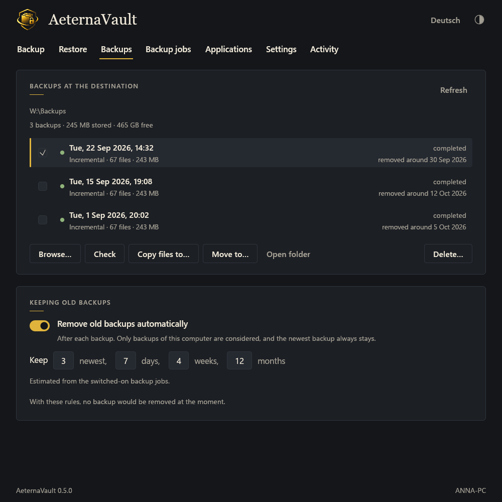
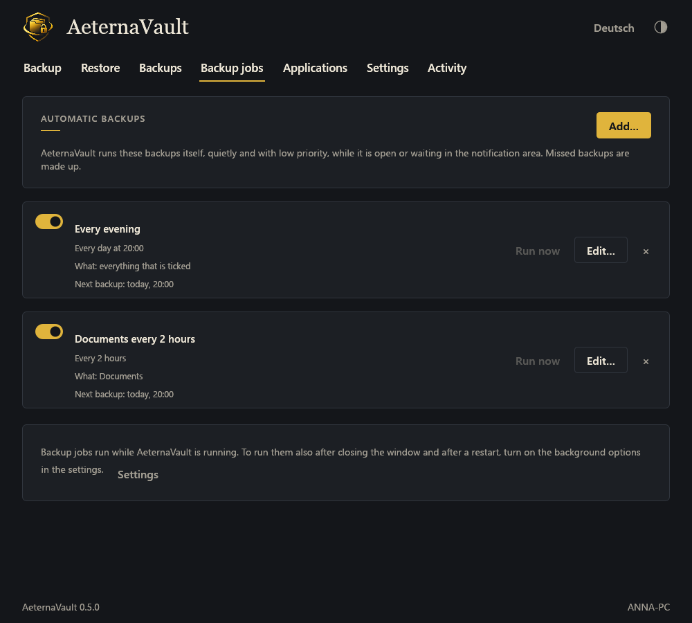
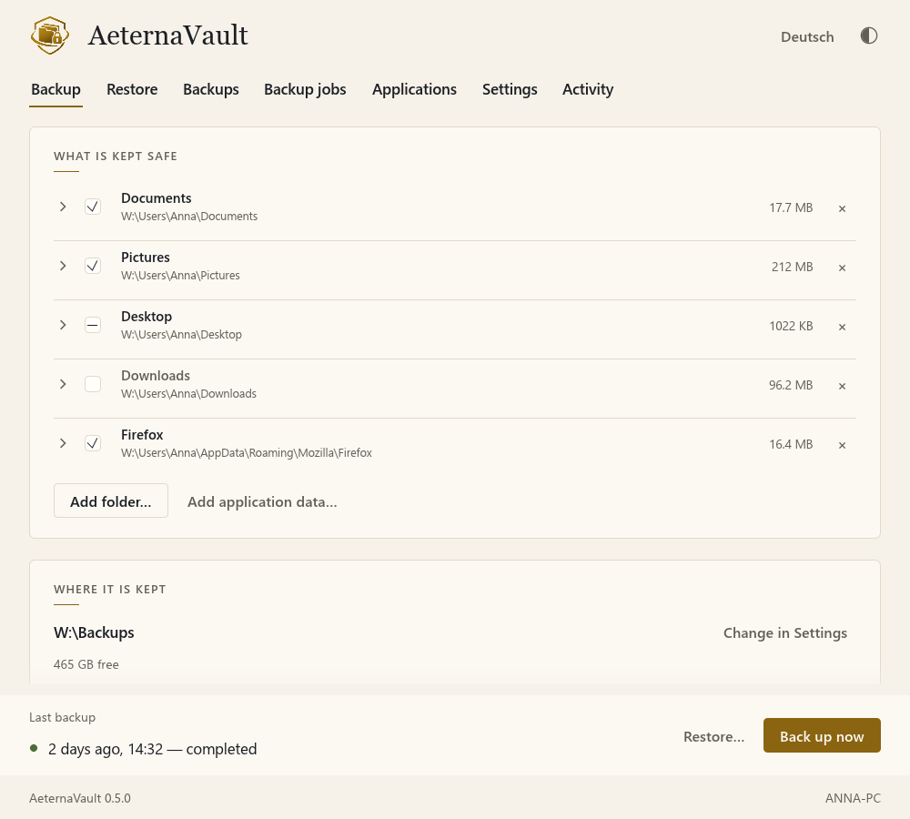
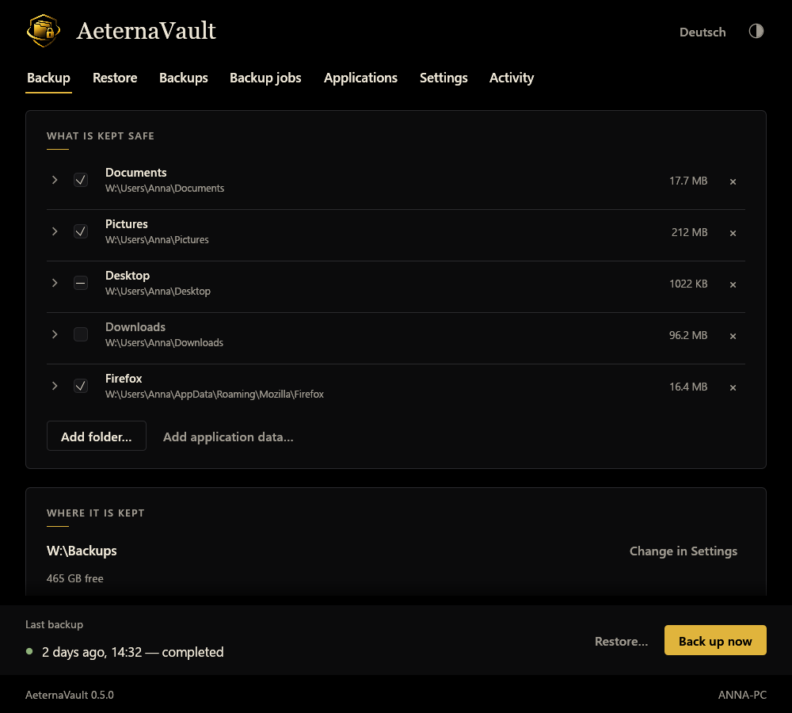

<div align="center">

<picture>
  <source media="(prefers-color-scheme: dark)" srcset="assets/logo/logo-dark-256.png">
  
</picture>

# AeternaVault

Backups of folders as plain, browsable folders, optionally encrypted. Windows and Linux, window and command line.

[](https://github.com/baba537/AeternaVault/actions/workflows/ci.yml)
[](https://github.com/baba537/AeternaVault/releases/latest)
[](#license)

</div>

<p align="center">
  
</p>

## Features

| | |
|---|---|
| Plain backups | Every backup is a normal folder named by its date. Unchanged files are hard links, so each backup looks complete but takes little space. |
| Encryption | Optional, for everything or only marked folders. Argon2id and XChaCha20-Poly1305 or AES-256-GCM; names and sizes stay hidden. Readable without AeternaVault ([format](docs/ENCRYPTION.md), [Python tool](tools/aeterna-decrypt.py)). |
| Selection | Tick or untick any sub-folder or file; exclusion patterns. |
| Application data | Detects data folders of browsers, mail, notes, SSH/GPG keys, games and OBS. Sign-ins and saved passwords are left out. |
| Backup jobs | Daily, weekly, every few hours or at start; missed backups are made up. Windows: notification area; Linux: systemd user timer. |
| Retention | Keep the newest, daily, weekly and monthly backups; the list shows when each backup will be removed. |
| Check and restore | Checksums for every file; restore to the original places or into a folder, all or single folders. |
| Command line | `aeternavault-cli` does everything the window does, with `--json`. PowerShell module on Windows. |
| Interface | English and German; light, dark and black (OLED); keyboard shortcuts, mouse back/forward, middle-click scrolling. |

## Download

| System | File | |
|---|---|---|
| Windows 10/11 (x64) | `AeternaVault-<version>-setup-x64.exe` | installer, updates keep settings |
| | `AeternaVault-<version>-windows-x64.zip` | without installation |
| Debian, Ubuntu, Mint | `aeternavault_<version>-1_amd64.deb` | window and command line |
| | `aeternavault-cli_<version>-1_amd64.deb` | command line only (servers) |
| Other Linux (x64) | `aeternavault-<version>-linux-x64.tar.gz` | window and command line, `install.sh` |
| | `aeternavault-cli-<version>-linux-x64.tar.gz` | command line only |

All files are on the [releases page](https://github.com/baba537/AeternaVault/releases/latest), with `SHA256SUMS.txt` and build attestations.

## Usage

1. Start AeternaVault. It suggests your personal folders and a destination on another drive.
2. Adjust the folders and click **Back up now** (Ctrl+B).
3. Set up automatic backups under **Backup jobs**.

Command line: [Windows](docs/cli-windows.md) · [Linux](docs/cli-linux.md)

```sh
aeternavault-cli destination set E:\Backups
aeternavault-cli source add ~/Documents
aeternavault-cli backup
aeternavault-cli restore latest --to D:\Restored
```

<table>
  <tr>
    <td></td>
    <td></td>
  </tr>
  <tr>
    <td></td>
    <td></td>
  </tr>
  <tr>
    <td></td>
    <td></td>
  </tr>
</table>

## Backup layout

```text
<destination>/
  2026-09-24 20-00/
    Documents/…                     plain copies
    .aeternavault/snapshot.json     date, sources, status
    .aeternavault/files.json        size, time and SHA-256 of every file
  .aeternavault/                    encrypted vault (only with encryption)
```

Encrypted backups keep their index in the same date folder. Browsing or restoring them always asks for the passphrase or recovery key, also when the key is remembered for automatic backups.

## Building

```sh
cargo build --release                                              # window and command line
cargo build --release --no-default-features --bin aeternavault-cli # command line only
```

See [CONTRIBUTING.md](CONTRIBUTING.md) for tests and Linux build packages, [docs/ARCHITECTURE.md](docs/ARCHITECTURE.md) for the structure and [docs/ROADMAP.md](docs/ROADMAP.md) for open items.

## License

MIT or Apache-2.0, at your option ([LICENSE-MIT](LICENSE-MIT), [LICENSE-APACHE](LICENSE-APACHE)).

Parts of this project were created with AI assistance.
