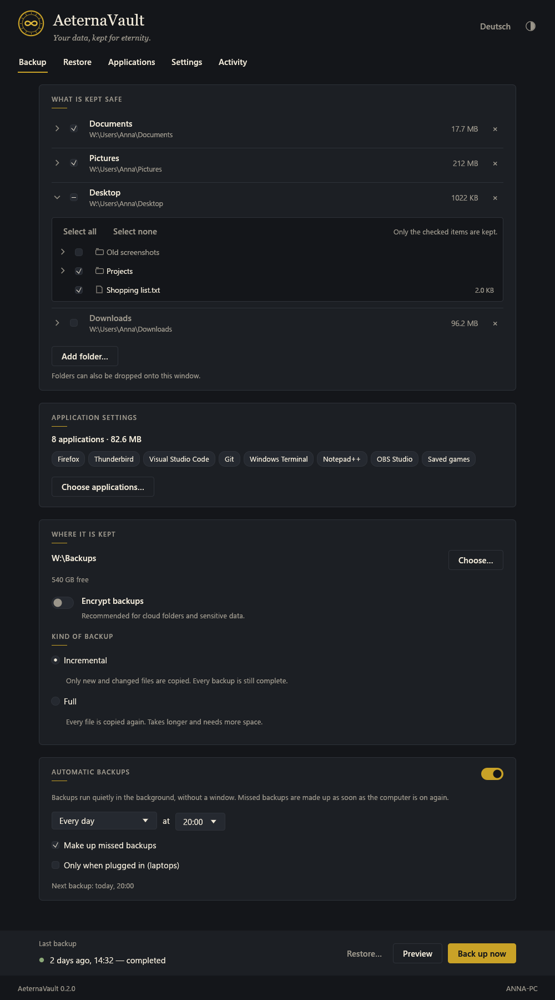
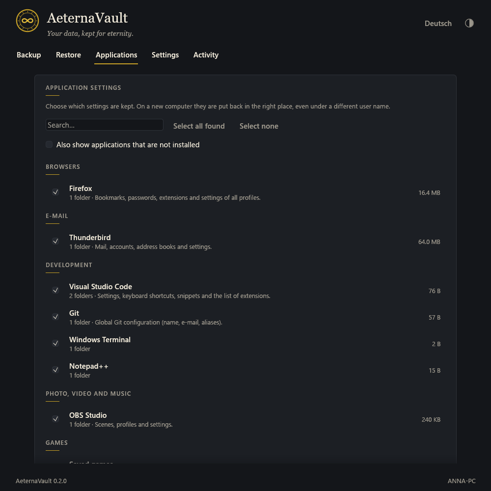
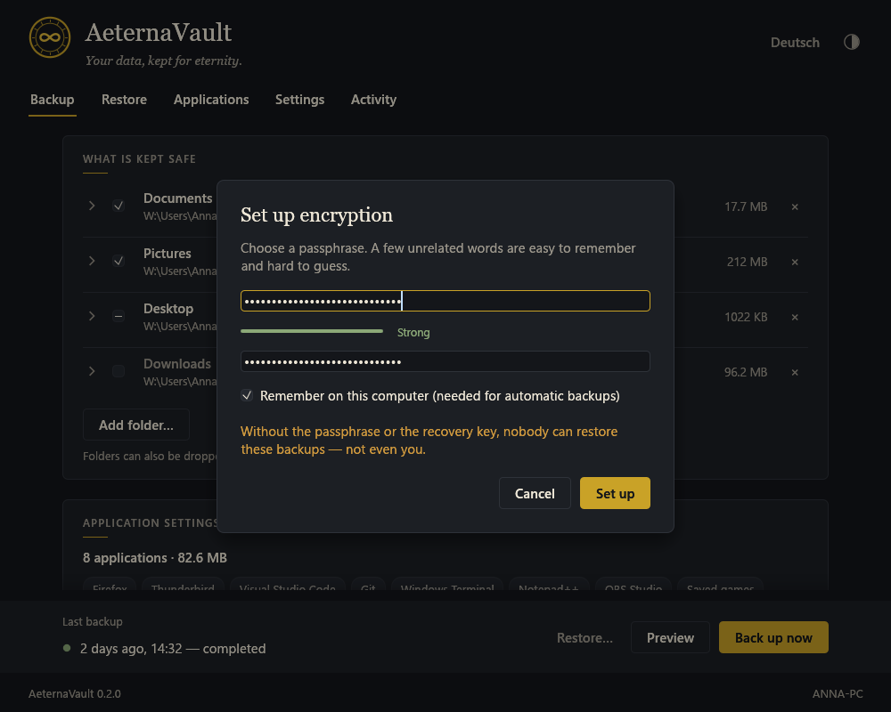
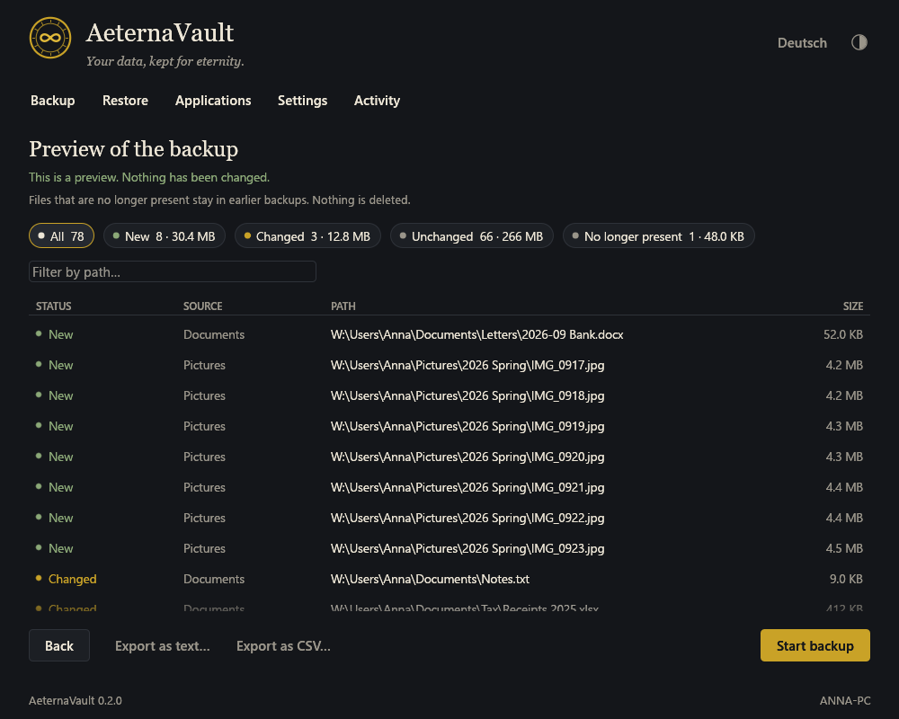
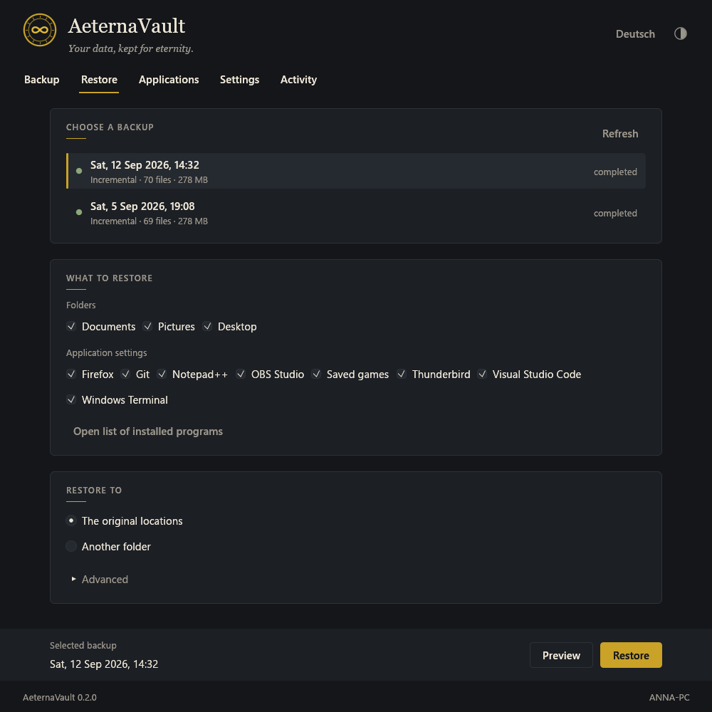
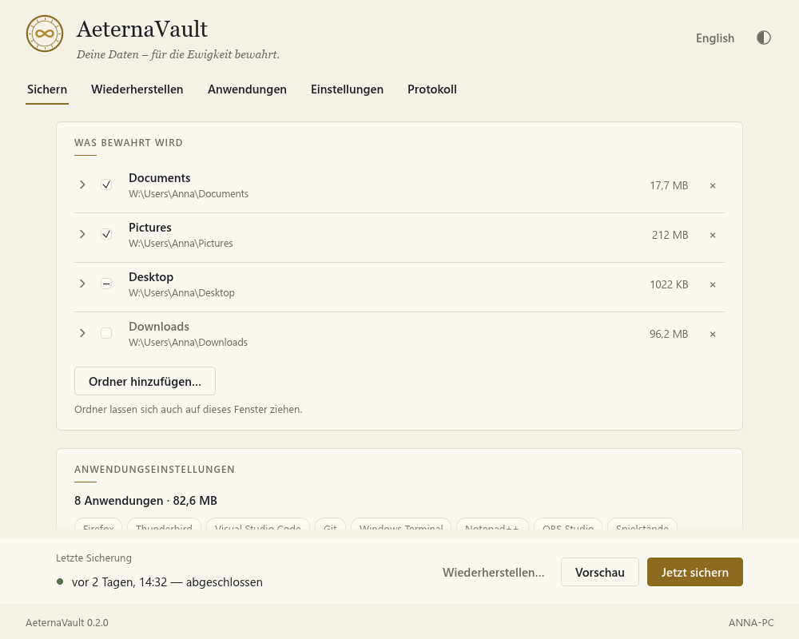

<div align="center">


# AeternaVault

*Your data, kept for eternity.*

A calm, careful backup tool for Windows — written in Rust.

[](https://github.com/baba537/AeternaVault/actions/workflows/ci.yml)
[](https://github.com/baba537/AeternaVault/releases/latest)
[](#license)

**[Download AeternaVault.exe](https://github.com/baba537/AeternaVault/releases/latest)** · [Features](#features) · [Usage](#usage) · [Building](#building-from-source) · [Documentation](#documentation)

</div>

<p align="center">
  
</p>

AeternaVault keeps copies of your folders and application settings the way a
well-run archive keeps its collection: quietly, completely, and so that you can
always check what is there. Back up before setting up a new computer, restore
afterwards, and your documents *and* your programs' settings are back in place.

The interface speaks **English and German** and can be switched at any time.

## Features

- **Simple by default.** On first start AeternaVault suggests your personal
  folders, the settings of applications it finds, and a destination on a second
  drive. One click on *Back up now* is enough.
- **Application settings.** A catalog of more than 60 applications and Windows
  settings — browsers, e-mail, editors, media and game saves, keyboard layouts,
  Explorer options, fonts and more. Folders *and* registry settings (HKCU) are
  kept and restored to the right place on another computer, even under a
  different user name.
- **Choose exactly what to keep.** Open any folder and tick or untick
  sub-folders and single files.
- **Encryption (optional).** Protect backups with a passphrase and a recovery key
  (Argon2id + XChaCha20-Poly1305). File names, folder structure and contents are
  unreadable without it — well suited for cloud folders. Unchanged files are
  never uploaded twice.
- **Automatic backups.** One switch: every day, every week, every few hours or at
  sign-in. Runs quietly through the Windows Task Scheduler, without a window, and
  makes up missed backups.
- **Preview first (dry run).** See which files are new, changed, unchanged, no
  longer present or skipped — with search, filters and export as text or CSV.
  The preview never writes anything.
- **Browsable backups.** Each backup is an ordinary folder:
  `Backups\2026-09-14 20-00\Documents\…` — three clicks to your files.
- **Incremental and verified.** Only new and changed files are copied; unchanged
  ones are hard-linked. SHA-256 checksums are verified on restore.
- **Safe restore.** Restore everything or only some folders and applications, to
  the original locations or into another folder. Nothing is ever deleted.
- **Ready for a new computer.** Every backup includes a list of installed
  programs (and a `winget` export for reinstalling most of them at once).
- **Considerate.** Warns when an application is open, skips OneDrive online-only
  files, links and junctions, and never backs up the destination into itself.
- **Hand-editable.** All settings live in a commented TOML file; the application
  catalog can be extended with your own `apps.toml`.

<table>
  <tr>
    <td></td>
    <td></td>
  </tr>
  <tr>
    <td align="center"><sub>Application settings to keep</sub></td>
    <td align="center"><sub>Setting up encryption</sub></td>
  </tr>
  <tr>
    <td></td>
    <td></td>
  </tr>
  <tr>
    <td align="center"><sub>Preview before every backup</sub></td>
    <td align="center"><sub>Choosing what to restore</sub></td>
  </tr>
  <tr>
    <td colspan="2"></td>
  </tr>
  <tr>
    <td colspan="2" align="center"><sub>Light appearance, German interface</sub></td>
  </tr>
</table>

## Installation

1. Download `AeternaVault.exe` from the
   [latest release](https://github.com/baba537/AeternaVault/releases/latest).
2. Optionally verify the file in PowerShell and compare with `SHA256SUMS.txt`:
   ```powershell
   Get-FileHash .\AeternaVault.exe -Algorithm SHA256
   ```
3. Start it. No installation, no administrator rights and no runtime libraries
   are needed.

> [!NOTE]
> Release builds are not code-signed yet, so Windows SmartScreen may show a
> warning ("More info" → "Run anyway").

Requirements: Windows 10 or 11, 64-bit.

## Usage

### Back up

1. **What is kept safe** — tick your folders. Click the arrow next to a folder to
   choose single sub-folders or files. Add more folders with *Add folder…* or by
   dragging them onto the window.
2. **Application settings** — *Choose applications…* shows everything found on
   this computer. Close open applications before backing up for a consistent copy.
3. **Where it is kept** — ideally a second disk, an external drive or a cloud
   folder. Turn on **Encrypt backups** for cloud folders and sensitive data.
4. Click **Preview** to see what will happen, or **Back up now**.

### Automatic backups

Turn on **Automatic backups** in the Backup view and choose how often. AeternaVault
creates a task in the Windows Task Scheduler (`\AeternaVault\Automatic backup`)
that runs `AeternaVault.exe backup --scheduled` — no window, low priority. If the
destination drive is not connected, the run is skipped quietly; the result is
shown the next time you open AeternaVault. Turning the switch off removes the task.

Encrypted automatic backups need the passphrase to be remembered on the computer
(it is protected with Windows DPAPI for your account only).

### Moving to a new computer

1. On the old computer: back up (folders and application settings).
2. On the new computer: install the programs you need — `Applications\Installed
   programs.txt` in the backup lists them, and `winget import -i
   winget-packages.json` reinstalls most of them at once.
3. Start AeternaVault, choose the same destination, open **Restore**, select the
   backup and restore to *the original locations*. Application folders and
   registry settings are adapted to the new user profile automatically.

### Encryption

- The passphrase is never stored. It unlocks a random vault key; a separate
  **recovery key** (shown once when setting up) unlocks it as well.
- Encrypted backups live in `<destination>\AeternaVault Encrypted\`. Please sync or
  copy the whole folder; files are shared between backups.
- To see the contents, open **Restore**, select the backup and **Unlock…**. Restore
  into a folder to look at the files.
- Details of the format: [docs/ENCRYPTION.md](docs/ENCRYPTION.md).

### What a backup looks like on disk

```text
D:\AeternaVault\Backups\
  2026-09-12 14-32\
    Documents\...
    Pictures\...
    Applications\
      Firefox\...
      Visual Studio Code\Settings\...
      7-Zip\Registry\HKCU - Software - 7-Zip.reg
      Installed programs.txt
      winget-packages.json
    .aeternavault\          (hidden: snapshot.json, files.json)
  AeternaVault Encrypted\   (only if encryption is used)
```

Plain backups can be opened and copied without AeternaVault; `.reg` files can be
imported with a double-click.

### Command line

```powershell
AeternaVault.exe backup                    # back up with the saved settings
AeternaVault.exe backup --dry-run          # only show what would happen
AeternaVault.exe backup --dry-run --csv plan.csv
AeternaVault.exe snapshots                 # list backups
AeternaVault.exe restore latest --to D:\Restored --dry-run
AeternaVault.exe restore latest --to D:\Restored --yes
AeternaVault.exe paths                     # where settings and logs are stored
```

Encrypted backups use the key remembered on the computer, or the passphrase from
the environment variable `AETERNAVAULT_PASSPHRASE`.

Exit codes: `0` success, `1` error, `2` completed with notes or confirmation missing.

### Settings

| What | Where |
|---|---|
| Configuration | `%APPDATA%\AeternaVault\config.toml` |
| Own application catalog entries | `%APPDATA%\AeternaVault\apps.toml` |
| Remembered vault keys (DPAPI) | `%APPDATA%\AeternaVault\keys\` |
| Result of the last automatic backup | `%APPDATA%\AeternaVault\state.json` |
| Logs (14 days) | `%LOCALAPPDATA%\AeternaVault\logs\` |
| Portable mode | put an `AeternaVault.toml` next to the EXE |
| Custom location | set the environment variable `AETERNAVAULT_HOME` |

Example configuration:

```toml
language = "auto"          # "auto", "en" or "de"
appearance = "system"      # "system", "dark" or "light"
destination = 'D:\AeternaVault\Backups'
mode = "incremental"       # or "full"
exclude = ["Thumbs.db", "desktop.ini", "~$*", "*.tmp"]

[encryption]
enabled = false

[schedule]
enabled = true
frequency = "daily"        # "daily", "weekly", "hourly", "at-logon"
time = "20:00"
weekday = "sunday"
every_hours = 4
catch_up = true
only_on_ac_power = false

[advanced]
skip_online_only_files = true
hardlink_unchanged = true
confirm_before_start = true
verify_on_restore = true
restore_conflict = "replace-changed"   # "keep-existing", "keep-newer"
save_program_list = true

[[source]]
name = "Desktop"
path = 'C:\Users\Anna\Desktop'
enabled = true
exclude_paths = ["Old screenshots"]

[[application]]
id = "firefox"

[[application]]
id = "vscode"
```

Adding an application to the catalog (`apps.toml` next to `config.toml`):

```toml
[[app]]
id = "my-tool"
name = "My Tool"
category = "utilities"
processes = ["mytool.exe"]
registry = ['HKCU\Software\My Company\My Tool']
[[app.folder]]
path = '{APPDATA}\My Tool'
exclude = ["cache", "*.log"]
```

## Current limitations

AeternaVault is a young project. Please keep a second copy of data that matters.

- Files that another program locks exclusively (e.g. an open Outlook PST) are
  reported and skipped — Volume Shadow Copy support is planned.
- Old backups are not removed automatically yet.
- Browser passwords and some app databases are protected by the Windows account;
  after a reinstall of Windows they may need the application's own sync.
- Registry settings are limited to `HKEY_CURRENT_USER`.

See the [roadmap](docs/ROADMAP.md) for what comes next.

## Building from source

Requirements: [Rust](https://rustup.rs/) 1.88 or newer and, for the MSVC
toolchain, the *Visual Studio Build Tools* with "Desktop development with C++".

```powershell
git clone https://github.com/baba537/AeternaVault.git
cd AeternaVault
cargo run                      # debug build with console log
cargo test                     # engine, encryption and interface tests
cargo build --release          # target\release\AeternaVault.exe
```

Optional: a smaller executable with the OpenGL renderer instead of wgpu
(Direct3D 12):

```powershell
cargo build --release --no-default-features --features glow
```

The C runtime is linked statically (see `.cargo/config.toml`), so the resulting
EXE runs on a fresh Windows installation.

### Releases

Pushing a version tag builds and publishes `AeternaVault.exe`, a ZIP package
and `SHA256SUMS.txt` via GitHub Actions:

```powershell
git tag v0.2.0
git push origin v0.2.0
```

Code signing is prepared in `.github/workflows/release.yml` and activates when
the secrets `WINDOWS_SIGNING_CERT_BASE64` and `WINDOWS_SIGNING_CERT_PASSWORD`
are set.

## Project structure

```text
src/
  main.rs, cli.rs        entry point and command line
  config.rs, paths.rs    settings file and locations
  state.rs               result of automatic backups
  i18n.rs                English and German texts
  engine/                scan, selection, plan (preview), backup, restore,
                         index format, encryption (crypto, vault)
  platform/              Windows specifics, application catalog (apps.toml),
                         registry, portable paths, Task Scheduler, VSS interface
  gui/                   state, actions, dialogs, theme, widgets, views, tests
assets/icon/             application icon (generated by tools/make-icon.ps1)
docs/                    architecture, encryption, design, roadmap, screenshots
.github/workflows/       CI and release
```

## Documentation

- [Architecture](docs/ARCHITECTURE.md) — modules, data flow, preview guarantees, crate choices and alternatives
- [Encryption](docs/ENCRYPTION.md) — how encrypted backups are stored and protected
- [Design](docs/DESIGN.md) — colors, typography, layout, voice
- [Roadmap](docs/ROADMAP.md) — ideas for the next versions
- [Contributing](CONTRIBUTING.md) · [Security](SECURITY.md) · [Changelog](CHANGELOG.md)

## Name

*Aeterna* is Latin for "eternal", a *vault* is where valuable things are kept.
In German: *Deine Daten – für die Ewigkeit bewahrt.*

## License

Licensed under either of

- Apache License, Version 2.0 ([LICENSE-APACHE](LICENSE-APACHE))
- MIT license ([LICENSE-MIT](LICENSE-MIT))

at your option.

Unless you explicitly state otherwise, any contribution intentionally submitted
for inclusion in the work by you, as defined in the Apache-2.0 license, shall be
dual licensed as above, without any additional terms or conditions.
