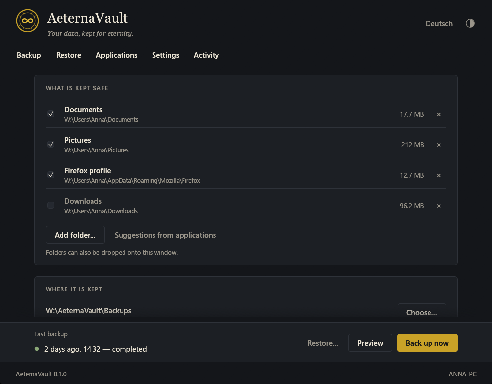

<div align="center">


# AeternaVault

*Your data, kept for eternity.*

A calm, careful backup tool for Windows — written in Rust.

[](https://github.com/baba537/AeternaVault/actions/workflows/ci.yml)
[](https://github.com/baba537/AeternaVault/releases/latest)
[](#license)

**[Download AeternaVault.exe](https://github.com/baba537/AeternaVault/releases/latest)** · [Features](#features) · [Usage](#usage) · [Building](#building-from-source) · [Documentation](#documentation)

</div>

<p align="center">
  
</p>

AeternaVault keeps copies of your folders the way a well-run archive keeps its
collection: quietly, completely, and so that you can always check what is there.
Every backup is an ordinary folder you can open in Explorer. Before anything is
written, a preview shows exactly what will happen.

The interface speaks **English and German** and can be switched at any time.

## Features

- **Simple by default.** On first start AeternaVault suggests your personal folders
  (Desktop, Documents, Pictures, …) and a destination on a second drive. One click
  on *Back up now* is enough.
- **Preview first (dry run).** See which files are new, changed, unchanged, no
  longer present or skipped — with size, search and filters. Export the list as
  text or CSV. The preview never writes anything.
- **Incremental and complete.** Only new and changed files are copied; unchanged
  files are hard-linked from the previous backup. Every backup folder still
  contains everything and can be browsed or copied on its own.
- **Verified.** A SHA-256 checksum is stored for every file and checked again when
  restoring. Damaged files are reported, never silently restored.
- **Safe restore.** Restore to the original locations or into another folder.
  Choose whether existing files are replaced, kept, or kept only if newer.
  Nothing is ever deleted.
- **Sensible exclusions.** Links and junctions are not followed, OneDrive
  online-only files are skipped, temporary files are ignored, and the backup
  destination is never backed up into itself.
- **Application data.** Suggestions for profiles and settings worth keeping
  (Firefox, Thunderbird, Chrome, Edge, VS Code, …) and an overview of installed
  programs.
- **Dark and light.** Follows Windows or your own choice.
- **Hand-editable.** All settings live in a commented TOML file.
- **Scriptable.** A command line for the Task Scheduler and for automation.

<table>
  <tr>
    <td></td>
    <td></td>
  </tr>
  <tr>
    <td align="center"><sub>Preview before every backup</sub></td>
    <td align="center"><sub>Choosing a backup to restore</sub></td>
  </tr>
  <tr>
    <td colspan="2"></td>
  </tr>
  <tr>
    <td colspan="2" align="center"><sub>Light appearance, German interface</sub></td>
  </tr>
</table>

## Installation

1. Download `AeternaVault.exe` from the
   [latest release](https://github.com/baba537/AeternaVault/releases/latest).
2. Optionally verify the file in PowerShell and compare with `SHA256SUMS.txt`:
   ```powershell
   Get-FileHash .\AeternaVault.exe -Algorithm SHA256
   ```
3. Start it. No installation, no administrator rights and no runtime libraries
   are needed.

> [!NOTE]
> Release builds are not code-signed yet, so Windows SmartScreen may show a
> warning ("More info" → "Run anyway").

Requirements: Windows 10 or 11, 64-bit.

## Usage

### Back up

1. Check the folders under **What is kept safe**. Add more with *Add folder…* or
   by dragging folders onto the window.
2. Check **Where it is kept** — ideally a second disk or an external drive.
3. Click **Preview** to see what will happen, or **Back up now** to start after a
   short confirmation.

### Restore

1. Open **Restore** and choose a backup.
2. Choose *The original locations* or *Another folder*.
3. Click **Preview** to see which files would be created or replaced, then
   **Restore**.

### What a backup looks like on disk

```text
D:\AeternaVault\Backups\
  YOUR-PC\
    2026-09-12_143200\
      snapshot.json      status, time, sources, statistics
      files.json         every file with size, date and SHA-256
      data\
        Documents\...
        Pictures\...
```

The folders can be opened and copied without AeternaVault.

### Command line

```powershell
AeternaVault.exe backup                    # back up with the saved settings
AeternaVault.exe backup --dry-run          # only show what would happen
AeternaVault.exe backup --dry-run --csv plan.csv
AeternaVault.exe snapshots                 # list backups
AeternaVault.exe restore latest --to D:\Restored --dry-run
AeternaVault.exe restore latest --to D:\Restored --yes
AeternaVault.exe paths                     # where settings and logs are stored
```

A daily backup at 20:00 via the Windows Task Scheduler:

```powershell
schtasks /Create /SC DAILY /ST 20:00 /TN "AeternaVault backup" /TR "\"C:\Tools\AeternaVault.exe\" backup"
```

Exit codes: `0` success, `1` error, `2` completed with notes or confirmation missing.

### Settings

| What | Where |
|---|---|
| Configuration | `%APPDATA%\AeternaVault\config.toml` |
| Logs (14 days) | `%LOCALAPPDATA%\AeternaVault\logs\` |
| Portable mode | put an `AeternaVault.toml` next to the EXE |
| Custom location | set the environment variable `AETERNAVAULT_HOME` |

Example configuration:

```toml
language = "auto"          # "auto", "en" or "de"
appearance = "system"      # "system", "dark" or "light"
destination = 'D:\AeternaVault\Backups'
mode = "incremental"       # or "full"
exclude = ["Thumbs.db", "desktop.ini", "~$*", "*.tmp"]

[advanced]
skip_online_only_files = true
hardlink_unchanged = true
confirm_before_start = true
verify_on_restore = true
restore_conflict = "replace-changed"   # "keep-existing", "keep-newer"

[[source]]
name = "Documents"
path = 'C:\Users\Anna\Documents'
enabled = true

[[source]]
name = "Firefox profile"
path = 'C:\Users\Anna\AppData\Roaming\Mozilla\Firefox'
enabled = true
exclude = ["Crash Reports", "parent.lock"]
```

## Current limitations

AeternaVault 0.1 is a young project. Please keep a second copy of data that
matters to you.

- Files that another program locks exclusively (e.g. an open Outlook PST) are
  reported and skipped — Volume Shadow Copy support is planned.
- Backups are not compressed or encrypted yet.
- There is no built-in schedule or removal of old backups yet (use the Task
  Scheduler for now).
- Registry settings are not backed up yet.

See the [roadmap](docs/ROADMAP.md) for what comes next.

## Building from source

Requirements: [Rust](https://rustup.rs/) (stable) and, for the MSVC toolchain,
the *Visual Studio Build Tools* with "Desktop development with C++".

```powershell
git clone https://github.com/baba537/AeternaVault.git
cd AeternaVault
cargo run                      # debug build with console log
cargo test
cargo build --release          # target\release\AeternaVault.exe
```

Optional: a smaller executable with the OpenGL renderer instead of wgpu
(Direct3D 12):

```powershell
cargo build --release --no-default-features --features glow
```

The C runtime is linked statically (see `.cargo/config.toml`), so the resulting
EXE runs on a fresh Windows installation.

### Releases

Pushing a version tag builds and publishes `AeternaVault.exe`, a ZIP package
and `SHA256SUMS.txt` via GitHub Actions:

```powershell
git tag v0.1.0
git push origin v0.1.0
```

Code signing is prepared in `.github/workflows/release.yml` and activates when
the secrets `WINDOWS_SIGNING_CERT_BASE64` and `WINDOWS_SIGNING_CERT_PASSWORD`
are set.

## Project structure

```text
src/
  main.rs, cli.rs        entry point and command line
  config.rs, paths.rs    settings file and locations
  i18n.rs                English and German texts
  logging.rs, error.rs
  engine/                scan, plan (preview), backup, restore, index format
  platform/              Windows specifics, application discovery, VSS interface
  gui/                   theme, widgets, background tasks, views
assets/icon/             application icon (generated by tools/make-icon.ps1)
docs/                    architecture, design concept, roadmap, screenshots
.github/workflows/       CI and release
```

## Documentation

- [Architecture](docs/ARCHITECTURE.md) — modules, data flow, preview guarantees, crate choices and alternatives
- [Design](docs/DESIGN.md) — colors, typography, layout, voice
- [Roadmap](docs/ROADMAP.md) — ideas for the next versions
- [Contributing](CONTRIBUTING.md) · [Security](SECURITY.md) · [Changelog](CHANGELOG.md)

## Name

*Aeterna* is Latin for "eternal", a *vault* is where valuable things are kept.
In German: *Deine Daten – für die Ewigkeit bewahrt.*

## License

Licensed under either of

- Apache License, Version 2.0 ([LICENSE-APACHE](LICENSE-APACHE))
- MIT license ([LICENSE-MIT](LICENSE-MIT))

at your option.

Unless you explicitly state otherwise, any contribution intentionally submitted
for inclusion in the work by you, as defined in the Apache-2.0 license, shall be
dual licensed as above, without any additional terms or conditions.
