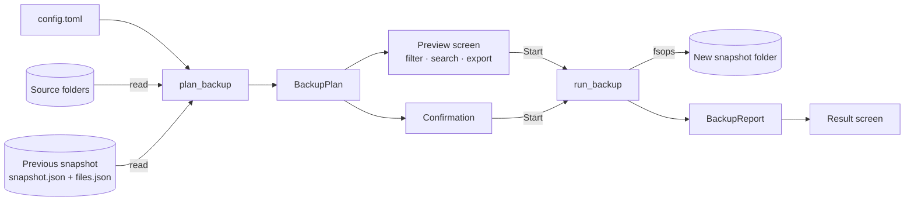
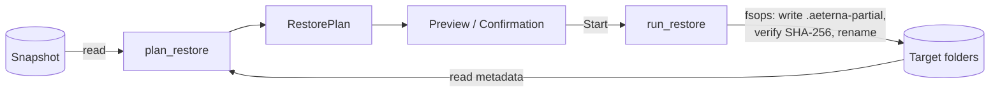

# Architecture

AeternaVault is a single Rust binary with a clear split between the **engine**
(what happens to files) and the **interface** (how people see and control it).
Everything in this document describes the current state and the reasons behind
it. None of it is set in stone.

## Modules

```text
src/
├── main.rs            entry point: GUI without arguments, CLI with a subcommand
├── cli.rs             command line (clap): backup, snapshots, restore, paths
├── config.rs          TOML configuration with defaults for every field
├── paths.rs           where config and logs live (standard, portable, env override)
├── i18n.rs            all user-facing texts, English and German
├── logging.rs         tracing: rotating log file + in-memory buffer for the GUI
├── error.rs           engine error type
├── engine/
│   ├── mod.rs         shared helpers, progress, cancellation, read-only guard test
│   ├── scan.rs        walks sources (read-only)
│   ├── snapshots.rs   finds existing backups (read-only)
│   ├── manifest.rs    on-disk format of a backup (read-only)
│   ├── plan.rs        preview / dry run: BackupPlan, RestorePlan (read-only)
│   ├── backup.rs      executes a BackupPlan
│   ├── restore.rs     executes a RestorePlan
│   ├── fsops.rs       the only place that writes files
│   ├── export.rs      preview export as text / CSV
│   └── tests.rs       end-to-end tests on temporary folders
├── platform/
│   ├── mod.rs         OS helpers with fallbacks (drives, free space, explorer)
│   ├── windows.rs     a few Win32 calls via windows-sys
│   ├── apps.rs        known application data folders, installed programs (registry)
│   └── vss.rs         FileReader interface; Volume Shadow Copy comes later
└── gui/
    ├── mod.rs         app state, background tasks, header, navigation, dialogs
    ├── theme.rs       palette, typography, fonts
    ├── widgets.rs     cards, buttons, section titles, logo, progress line
    ├── tasks.rs       worker threads with progress and cancellation
    └── views/         backup, restore, preview, working/done, apps, settings, activity
```

## Data flow

Every operation is split into **plan** (read-only) and **execute**. The preview
is not a separate code path that imitates a backup — it *is* the first half of
the real backup.





### Why the preview is trustworthy

- `plan.rs`, `scan.rs`, `snapshots.rs` and `manifest.rs` only read. A unit test
  (`planning_modules_are_read_only`) fails if they mention writing APIs.
- `BackupPlan` / `RestorePlan` are plain data. The executors take a plan by
  reference and re-check each file's size and modification time before acting,
  so changes between preview and start are handled correctly.
- End-to-end tests assert that planning creates no files and no folders.

### GUI threading

The engine is synchronous. The GUI runs every plan and execution on a worker
thread (`gui/tasks.rs`) and receives progress through a channel; each message
wakes the UI with `request_repaint`. Cancellation is a shared atomic flag that
the engine checks between files and between 1 MiB copy chunks. Panics in a
worker are caught and shown as a calm error instead of closing the window.

## Backup format

```text
D:\AeternaVault\Backups\
  DESKTOP-1234\                     one folder per computer
    2026-09-14_143205\              one folder per backup
      snapshot.json                 header: status, times, sources, statistics
      files.json                    index: path, size, modified, SHA-256, blob
      data\
        Documents\letter.docx
        Pictures\2026\summer.jpg
```

- **Every backup is complete and browsable.** Incremental backups hard-link
  unchanged files from the previous backup (NTFS). On file systems without hard
  links (exFAT, FAT32, some NAS shares) the index points to the older copy
  instead (`blob` field).
- **`snapshot.json` is written last.** A folder without it is an unfinished backup
  and is never used as the base of an incremental backup.
- **Files are written as `*.aeterna-partial` and renamed** when complete.
- **Restores verify SHA-256** before a file replaces anything.
- **Paths from the index are sanitised** (`safe_relative_path`), so a damaged or
  crafted `files.json` cannot make a restore write outside its target.

## Crates

| Area | Crate | Why | Alternatives |
|---|---|---|---|
| GUI | `eframe` / `egui` | One dependency, draws everything itself, easy to give a custom calm look, immediate mode keeps state simple | `iced` (Elm architecture, good theming), `slint` (declarative UI files, commercial-friendly licence), `tauri` (HTML/CSS UI, larger footprint, WebView2) |
| Renderer | `wgpu` (default) | Direct3D 12 with software fallback: works in VMs and remote sessions | `glow` feature: OpenGL, smaller executable |
| Dialogs | `rfd` | Native Windows file and folder pickers | `windows` crate `IFileOpenDialog` directly |
| Windows APIs | `windows-sys` | Raw bindings, no COM wrapper overhead, fast compile | `windows` (safer wrappers; needed for VSS/COM later), `winapi` (unmaintained) |
| Registry | `winreg` | Small, idiomatic read access to Uninstall keys | `windows-registry` from the windows-rs project |
| Config | `serde` + `toml` | Comments allowed, friendly to hand-editing | `serde_json`, `ron` |
| Index | `serde_json` | Human-readable, robust, universally supported | SQLite (`rusqlite`) for very large backups, `postcard`/`bincode` |
| Paths | `directories` | Known Folders incl. redirection (OneDrive) | `dirs`, `known-folders` |
| Walking | `walkdir` | Mature, does not follow links, fine-grained control | `jwalk` (parallel), `ignore` |
| Excludes | `globset` | Fast glob matching from ripgrep, case-insensitive | `glob`, `wildmatch` |
| Checksums | `sha2` | Pure Rust, SHA-256 is verifiable with `Get-FileHash` | `blake3` (faster), `xxhash` (non-cryptographic) |
| Errors | `thiserror`, `anyhow` | Typed engine errors, simple top-level handling | `snafu`, `miette` |
| Logging | `tracing`, `tracing-subscriber`, `tracing-appender` | Structured fields, rotating files, custom GUI layer | `log` + `simplelog` / `flexi_logger` |
| CLI | `clap` (derive) | Standard, generates help and validation | `argh`, `pico-args` |
| Locale | `sys-locale` | Tiny, detects the Windows UI language | `windows` `GetUserDefaultLocaleName` |
| Icon | `winresource` (build) | Embeds icon and version info into the EXE | `embed-resource` |

## Configuration and paths

| What | Default location |
|---|---|
| Configuration | `%APPDATA%\AeternaVault\config.toml` |
| Logs | `%LOCALAPPDATA%\AeternaVault\logs\aeterna-vault.YYYY-MM-DD.log` (14 days) |
| Portable mode | `AeternaVault.toml` next to the EXE, logs in `logs\` beside it |
| Override | environment variable `AETERNAVAULT_HOME` |

## Extension points

- **Volume Shadow Copy:** implement `platform::vss::FileReader` and pass it to
  `backup::run_backup`.
- **Other sources (registry keys, app settings):** add a source kind next to
  folders in `config.rs`; the planner already works on generic items.
- **Scheduling:** the CLI (`AeternaVault.exe backup`) is designed for the Task
  Scheduler; a settings page can create the task.
- **Languages:** see `CONTRIBUTING.md`.
