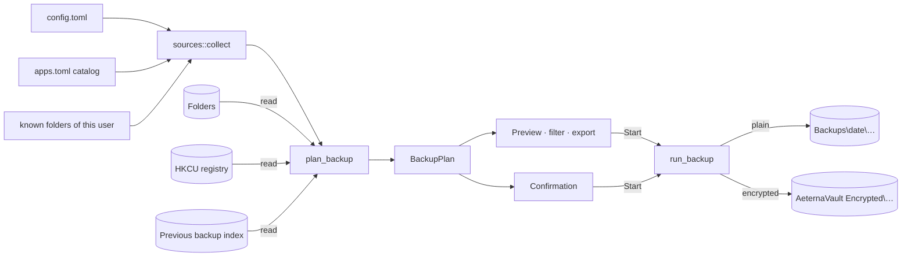
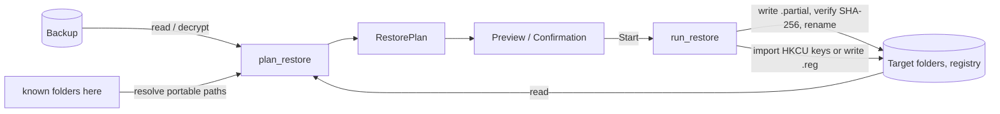

# Architecture

AeternaVault is a single Rust binary with a clear split between the **engine**
(what happens to files), the **platform** layer (Windows specifics) and the
**interface** (how people see and control it). Everything in this document
describes the current state and the reasons behind it. None of it is set in stone.

## Modules

```text
src/
├── main.rs            entry point: GUI without arguments, CLI with a subcommand
├── cli.rs             command line (clap): backup, snapshots, restore [--destination], open, add, paths (docs/CLI.md)
├── config.rs          TOML configuration with defaults for every field
├── paths.rs           where config and logs live (standard, portable, env override)
├── state.rs           when each schedule last ran (shared by window and service)
├── history.rs         activity history (history.jsonl), written by window, service and CLI
├── i18n.rs            all user-facing texts, English and German
├── logging.rs         tracing: rotating log file + in-memory buffer for the GUI
├── error.rs           engine error type
├── automatic/
│   ├── mod.rs         unattended backup (shared with the CLI), retention after runs
│   ├── timing.rs      when a schedule is due (pure, tested)
│   └── service.rs     background thread that runs due schedules
├── engine/
│   ├── mod.rs         shared helpers, progress, cancellation, read-only guard test
│   ├── sources.rs     config + catalog → concrete folders and registry keys (read-only)
│   ├── selection.rs   chosen sub-folders/files of a source (read-only)
│   ├── scan.rs        walks sources (read-only)
│   ├── snapshots.rs   finds plain, encrypted and legacy backups (read-only)
│   ├── manifest.rs    on-disk format of a backup (read-only)
│   ├── plan.rs        preview / dry run: BackupPlan, RestorePlan (read-only)
│   ├── verify.rs      check a backup without restoring (read-only)
│   ├── retention.rs   which old backups the rules would remove, and when (read-only)
│   ├── manage.rs      delete (with re-homing), move, extract, prune vault blobs
│   ├── backup.rs      executes a BackupPlan (plain part, encrypted part, or both)
│   ├── restore.rs     executes a RestorePlan (files and registry)
│   ├── fsops.rs       the only place that writes files; destination lock
│   ├── crypto.rs      Argon2id, XChaCha20-Poly1305 / AES-256-GCM streams, key slots
│   ├── passphrase.rs  passphrase rating (length, kinds of characters, patterns)
│   ├── vault.rs       encrypted vault on disk, remembered keys
│   ├── export.rs      preview export as text / CSV
│   └── tests.rs       end-to-end tests on temporary folders
├── platform/
│   ├── mod.rs         OS helpers with fallbacks (drives, free space, DPAPI, processes)
│   ├── windows.rs     a few Win32 calls via windows-sys
│   ├── apps.rs        application catalog loader, installed programs, winget export
│   ├── apps.toml      the built-in catalog (65 applications and Windows settings)
│   ├── known_paths.rs {APPDATA}-style portable paths, profile remapping
│   ├── registry.rs    HKCU export/import, .reg files
│   ├── scheduler.rs   removes the Task Scheduler entry of 0.2
│   ├── tray.rs        notification area icon (Shell_NotifyIconW on its own thread)
│   ├── instance.rs    one window per configuration, activating the running one
│   ├── autostart.rs   HKCU Run entry, switched on/off via StartupApproved
│   ├── context_menu.rs  "Back up with AeternaVault" for folders; hand-over to the window
│   ├── file_association.rs  .avault double-click (HKCU\Software\Classes)
│   └── vss.rs         FileReader interface; Volume Shadow Copy comes later
└── gui/
    ├── mod.rs         application state and frame layout
    ├── actions.rs     background loaders, tasks, vault and schedule handling
    ├── background.rs  tray events, hide on close, connection to the service
    ├── manage.rs      check, delete, move, browse, extract; viewer mode
    ├── dialogs.rs     confirmation and encryption dialogs
    ├── theme.rs       palette, typography, fonts
    ├── widgets.rs     cards, buttons, toggle, section titles, logo, progress line
    ├── tasks.rs       worker threads with progress and cancellation
    ├── tests.rs       interface tests (egui_kittest) and screenshot rendering
    └── views/         backup, restore, backups, jobs, browse, preview, working/done, apps, settings, activity
```

## Data flow

Every operation is split into **plan** (read-only) and **execute**. The preview
is not a separate code path that imitates a backup — it *is* the first half of
the real backup.





### Why the preview is trustworthy

- `plan.rs`, `scan.rs`, `sources.rs`, `selection.rs`, `snapshots.rs` and
  `manifest.rs` only read. A unit test (`planning_modules_are_read_only`) fails if
  they mention writing APIs, registry import or vault creation.
- `BackupPlan` / `RestorePlan` are plain data. The executors take a plan by
  reference and re-check each file's size and modification time before acting.
- End-to-end tests assert that planning creates no files and no folders.

### Moving between computers

Sources record both the absolute path and a **portable path** such as
`{APPDATA}\Mozilla\Firefox`. On restore to the original locations the tokens are
resolved for the current user. Registry string values containing the old
profile path (e.g. `C:\Users\anna\…`) are rewritten to the new profile.

### GUI threading

The engine is synchronous. The GUI runs every plan and execution on a worker
thread (`gui/tasks.rs`) and receives progress through a channel; each message
wakes the UI with `request_repaint`. Folder sizes, the backup list, application
detection and retention clean-up are small background jobs as well.
Cancellation is a shared atomic flag checked between files and between 1 MiB
chunks. Panics in a worker are caught and shown as a calm error.

### Automatic backups

AeternaVault runs schedules itself (`automatic/service.rs`): a thread wakes every
20 seconds or when poked, asks `timing::is_due` for each schedule, and runs the
first due one through `automatic::run_unattended` with background thread
priority. Occurrences before a schedule was switched on (`armed_at` in
`state.json`) are ignored; missed ones are made up once; a run skipped because
the drive was missing is retried every 15 minutes. The service never depends on
egui frames: while the window is hidden, eframe only calls `App::logic`, which
handles tray and service events. With "keep running" on, closing the window
hides it; the tray icon lives on its own Win32 thread. A named mutex keeps one
instance per configuration, and a second start posts a message to the tray
window of the running one. A lock file in the destination prevents two backups
(window, service, another computer) from writing at once.

### Partly encrypted backups

Each plan item carries `encrypted`. `backup.rs` writes a plain folder for the
unmarked items and an `.avs` index for the marked ones under the same id, both
with `split: true`; `snapshots::list` attaches the encrypted part to the plain
one as `companion`, and restore, verify, move and delete work on both parts.
Incremental reuse only happens within the same part.

### Deleting safely

On file systems without hard links, a plain incremental backup refers to files
stored in an older backup. `manage::delete` first copies such files into every
remaining backup that needs them (updating its `files.json`), then moves the
folder to the recycle bin (or deletes it where there is none). Encrypted blobs
are shared; they are removed only if no remaining encrypted index, all of which
must be readable, refers to them.

## Backup format

Plain (format 2):

```text
<destination>\
  2026-09-14 20-00\                one folder per backup; " (PC)" if several computers share it
    Documents\…                    source folders
    Applications\<App>\…           application folders (label sub-folders if several)
    Applications\<App>\Registry\*.reg
    Applications\Installed programs.txt, winget-packages.json
    .aeternavault\                 hidden: snapshot.json (header, written last), files.json (index)
```

- **Every backup is complete and browsable.** Incremental backups hard-link
  unchanged files from the previous backup (NTFS); on file systems without hard
  links the index points to the older copy (`blob` field).
- **Files are written as `*.aeterna-partial` and renamed** when complete.
- **Restores verify SHA-256** before a file replaces anything.
- **Paths from the index are sanitised** (`safe_relative_path`), so a damaged or
  crafted index cannot make a restore write outside its target.
- Format 1 backups (`<COMPUTER>\<id>\data\…`) from 0.1 are still listed,
  restorable and usable as incremental base.

Encrypted: see [ENCRYPTION.md](ENCRYPTION.md).

## Crates

| Area | Crate | Why | Alternatives |
|---|---|---|---|
| GUI | `eframe` / `egui` | One dependency, draws everything itself, easy to give a custom calm look, immediate mode keeps state simple | `iced` (Elm architecture), `slint` (declarative UI files), `tauri` (HTML/CSS UI, WebView2) |
| Renderer | `wgpu` + `glow` | Direct3D 12 on the power-saving GPU; OpenGL if Direct3D fails or on request ("compatibility graphics") | only one of them: smaller executable |
| Dialogs | `rfd` | Native Windows file and folder pickers | `windows` crate `IFileOpenDialog` |
| Windows APIs | `windows-sys` | Raw bindings for DPAPI, Toolhelp, priority, attributes; fast compile | `windows` (safer wrappers; needed for VSS/COM later) |
| Registry | `winreg` | Idiomatic HKCU export/import with raw value types | `windows-registry` |
| Schedules | own thread + Win32 tray icon | Several schedules with folders, nothing left in system tools, works with an unlocked (not remembered) key | Task Scheduler (used until 0.2; one task per schedule, runs without the app), `tray-icon` crate |
| Encryption | `argon2`, `chacha20poly1305`, `aes-gcm`, `hmac`, `getrandom`, `zeroize` | RustCrypto: pure Rust, widely reviewed, no C toolchain; two standard ciphers to choose from | `age` (file format, names not hidden, heavier dependency tree), `ring`/`aws-lc-rs` |
| Config | `serde` + `toml` | Comments allowed, friendly to hand-editing | `serde_json`, `ron` |
| Index | `serde_json` | Human-readable, robust | SQLite (`rusqlite`) for very large backups |
| Paths | `directories` | Known Folders incl. redirection (OneDrive) | `dirs`, `known-folders` |
| Walking | `walkdir` | Mature, does not follow links, fine-grained control | `jwalk` (parallel), `ignore` |
| Excludes | `globset` | Fast glob matching from ripgrep, case-insensitive | `glob`, `wildmatch` |
| Checksums | `sha2` | SHA-256 is verifiable with `Get-FileHash` | `blake3` |
| Errors | `thiserror`, `anyhow` | Typed engine errors, simple top-level handling | `snafu`, `miette` |
| Logging | `tracing`, `tracing-subscriber`, `tracing-appender` | Structured fields, rotating files, custom GUI layer | `log` + `simplelog` |
| CLI | `clap` (derive) | Standard, generates help and validation | `argh`, `pico-args` |
| Locale | `sys-locale` | Detects the Windows UI language | `GetUserDefaultLocaleName` |
| Icon | `winresource` (build) | Embeds icon and version info into the EXE | `embed-resource` |
| Interface tests | `egui_kittest` (dev) | Clicks the real UI headless via AccessKit; renders screenshots | manual testing |

## Configuration and paths

| What | Default location |
|---|---|
| Configuration | `%APPDATA%\AeternaVault\config.toml` |
| Own catalog entries | `%APPDATA%\AeternaVault\apps.toml` |
| Remembered vault keys | `%APPDATA%\AeternaVault\keys\` (DPAPI) |
| Automatic backup result | `%APPDATA%\AeternaVault\state.json` |
| Logs | `%LOCALAPPDATA%\AeternaVault\logs\aeterna-vault.YYYY-MM-DD.log` (14 days) |
| Portable mode | `AeternaVault.toml` next to the EXE, logs in `logs\` beside it |
| Override | environment variable `AETERNAVAULT_HOME` |
| Demo / test profile | `AETERNAVAULT_PROFILE_ROOT` points user folders to a fake profile and hides the real registry |

## Extension points

- **More applications:** add entries to `platform/apps.toml` or a user `apps.toml`.
- **Volume Shadow Copy:** implement `platform::vss::FileReader` and pass it to
  `backup::run_backup`.
- **Retention:** remove old plain backups and unreferenced encrypted blobs; the
  index already records where every file's content lives.
- **Languages:** see `CONTRIBUTING.md`.
